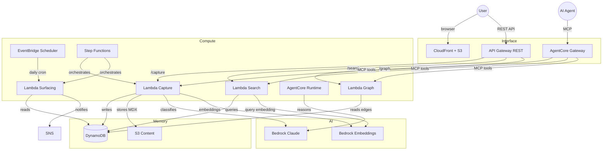

# Serverless Second Brain

Production-ready serverless backend for a personal knowledge graph on AWS. DynamoDB, Lambda, Bedrock, MCP, Step Functions, EventBridge, SNS, API Gateway, CloudFront, and AgentCore.

From the essay: [From Prototype to Production: A Serverless Second Brain on AWS](https://jonmatum.com/essays/from-prototype-to-production-serverless-second-brain)

## Architecture



## Two doors, same brain

| Door | Protocol | Auth | Use case |
|---|---|---|---|
| Human | REST API (API Gateway) | API key for writes, open reads | SPA, curl, integrations |
| Agent | MCP (AgentCore Gateway) | OAuth + semantic discovery | AI agents, Copilot, Claude |

Both doors call the same Lambda functions — the difference is protocol and auth.

## Cost

Scales to zero. No minimum costs beyond S3 storage.

| Load | Monthly cost |
|---|---|
| Idle (0 req/day) | ~$0.51 |
| Moderate (100 req/day) | ~$2.44 |
| High (1,000 req/day) | ~$11.21 |

Real cost data from production: [`docs/benchmarks/results.md`](docs/benchmarks/results.md)

## API

| Method | Endpoint | Description | Auth |
|---|---|---|---|
| `POST` | `/capture` | Ingest text → Bedrock classifies → DynamoDB | API key |
| `GET` | `/search?q=` | Hybrid keyword + semantic search | None |
| `GET` | `/graph` | Full knowledge graph (nodes + edges) | None |
| `GET` | `/nodes/{id}` | Single node with edges and related nodes | None |
| `GET` | `/health` | Service health check | None |

Full API spec: [`.kiro/steering/api-spec.md`](.kiro/steering/api-spec.md)

## MCP tools (agent door)

| Tool | Lambda | Description |
|---|---|---|
| `read_node` | Graph | Read a single node by slug |
| `list_nodes` | Graph | List nodes with filters |
| `search` | Search | Semantic + keyword search |
| `add_node` | Capture | Create a new knowledge node |
| `connect_nodes` | Capture | Create an edge between nodes |
| `flag_stale` | Surfacing | Mark a node for review |

Full MCP spec: [`.kiro/steering/mcp-tools.md`](.kiro/steering/mcp-tools.md)

## Phased delivery

Each phase is independently deployable.

| Phase | Components | Issues |
|---|---|---|
| 1 — Capture | Terraform foundation, DynamoDB, S3, Capture Lambda, API Gateway, Step Functions, data migration | #1 → #2 → #3 → #4 → #5 → #11 |
| 2 — Read | Search Lambda, Graph Lambda, CloudFront + S3 frontend | #6, #7, #10 |
| 3 — Agent | AgentCore Gateway + Runtime, MCP tools, write safety research | #8, #15 |
| 4 — Proactive | EventBridge scheduler, Surfacing Lambda, SNS notifications | #9 |
| Cross-cutting | Benchmarks, domain-agnostic config, observability | #12, #13, #14 |

## Prerequisites

- AWS account with Bedrock model access enabled:
  - `us.anthropic.claude-sonnet-4-20250514-v1:0`
  - `amazon.titan-embed-text-v2:0`
- Terraform >= 1.5
- Node.js 22.x
- GitHub repo with OIDC configured for AWS

## Project structure

```
infra/
  bootstrap/              → One-time Terraform state backend
  modules/                → Reusable Terraform modules
  environments/{dev,prod} → Environment roots

src/
  functions/{capture,search,graph,surfacing}/
  shared/                 → Types, clients, error handling

frontend/                 → Static Next.js export

scripts/                  → Migration, benchmarks, utilities
docs/decisions/           → ADRs
.kiro/steering/           → SDD specifications
.github/workflows/        → CI/CD (GitHub Actions OIDC)
```

## Specifications

All contracts defined before code — [Spec-Driven Development](https://jonmatum.com/concepts/spec-driven-development):

- [`architecture.md`](.kiro/steering/architecture.md) — layers, services, cost constraints, phases
- [`dynamodb-schema.md`](.kiro/steering/dynamodb-schema.md) — single-table design, item types, GSIs
- [`api-spec.md`](.kiro/steering/api-spec.md) — REST endpoints, schemas, error codes
- [`mcp-tools.md`](.kiro/steering/mcp-tools.md) — MCP tool definitions, write safety rules
- [`event-schemas.md`](.kiro/steering/event-schemas.md) — Step Functions, EventBridge, SNS contracts
- [`terraform-conventions.md`](.kiro/steering/terraform-conventions.md) — naming, modules, state, security
- [`code-conventions.md`](.kiro/steering/code-conventions.md) — TypeScript, Lambda patterns, commits

## Development

```sh
# Bootstrap (one-time)
cd infra/bootstrap && terraform init && terraform apply

# Deploy
cd infra/environments/dev && terraform init && terraform apply

# Lambda development
cd src/functions/capture && npm install && npm run build
```

## License

MIT
